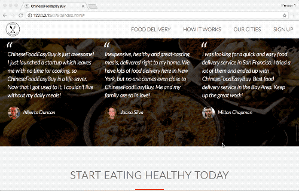

# Project Name

This is a fake website named ***Chinese Food Easy Buy*** which is used to order Chinese food easily on internet.

## Description

* Programming Language
	* **HTML5** - constructed the main structure and layout of this Web
	* **CSS3**  - described the presentation of this web page
	* **Javascript** - added animation and response to this Web
	* **PHP** - added effective response when sending forms

* Page Sections
	* [Home Page](#Home Page)
	* [Product Features](#Product Features)
	* [Chinese Food Showcase](#Chinese Food Showcase)
	* [Work Steps](#Work Steps)
	* [Available Cities](#Available Cities)
	* [Testimonials](#Testimonials)
	* [Product Available Plans](#AProduct Available Plans)
	* [Customer Form](#Customer Form)
	* [Copy Right](#Copy Right)

## Sections
### Home Page
-----------
Home page of Chinese Food Easy Buy, which has sticky main navigation bar and responsive buttons.

* Resizable page suitable for all size devices 

* Sticky Navigation Bar 

* Responsive Buttons 

### Product Features
-----------
Brief description of the delivery service of Chinese Food Easy Buy. 

### Chinese Food Showcase
-----------
Displacement of several Chinese Food.

* Special effect when hovering specific picture 

### Work Steps
-----------
Simple steps to order Chinese foods using Chinese Food Easy Buy.

* Animation of app screen picture 

### Available Cities
-----------
Cities available to use Chinese Food Easy Buy. 

### Testimonials
-----------
Customer feedbacks of service. 

### Product Available Plans
-----------
Available plans to choose from Chinese Food Easy Buy.

* Animation of best plan 

### Customer Form
-----------
Customer form used to submit informations.

* Form  

* Map 

### Copy Right
-----------
Copyright and social links to Chinese Food Easy Buy. 

## About me
I am **Aileen Yang**, and I have just finished my **master** degree in **NYU** in May 2018. 
I am now ***actively seeking for Software Development Engineer full-time position*** in ***Silicon Valley*** . 
Welcome to contact my if you would like to [offer me an oppotunity](mailto:yy1910@nyu.edu)! 
Please feel free to contact me if you have any question.
